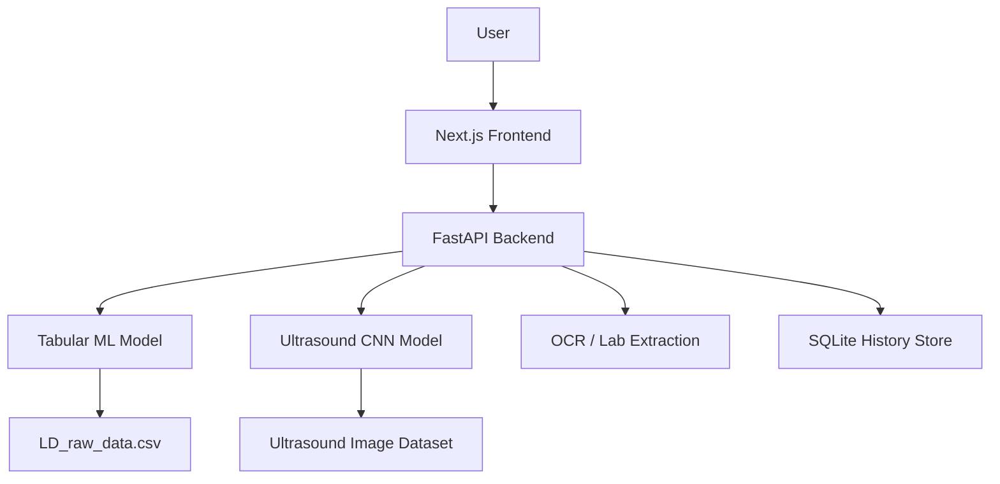

# Архитектура проекта Liver Disease Diagnosis

## 1. Назначение проекта

Проект представляет собой full-stack систему поддержки диагностики заболеваний печени. Он объединяет два основных направления анализа:

1. Классический ML-подход для прогнозирования болезни печени по структурированным лабораторным данным.
2. Глубокое обучение для классификации ультразвуковых изображений по классам benign, malignant и normal.

Система разработана не как набор исследовательских ноутбуков, а как практический web-продукт с backend API, frontend UI, обученными моделями и историей предсказаний.

---

## 2. Цели проекта

Основные цели проекта:

- обеспечить быстрый скрининг состояния печени;
- объединить лабораторную и визуальную диагностику в одну платформу;
- показать вероятностные результаты, а не только бинарные ответы;
- дать понятный и расширяемый web-интерфейс для врачей и исследователей;
- поддержать дальнейшее развитие в сторону более сложных медицинских AI-сценариев.

---

## 3. Общая концепция системы

Архитектура проекта построена по модульному принципу:

- frontend отвечает за взаимодействие с пользователем;
- backend выполняет инференс, обработку входных данных и оркестрацию;
- модели хранятся как отдельные артефакты и загружаются по мере необходимости;
- данные разделены на табличные и визуальные;
- история анализов сохраняется локально в базе данных.

Система условно состоит из шести слоёв:

1. UI layer — Next.js web app.
2. API layer — FastAPI backend.
3. Inference layer — модели ML и CNN.
4. Data layer — CSV, изображения, модели, SQLite.
5. Preprocessing layer — очистка, нормализация, augmentation, feature engineering.
6. Training layer — скрипты обучения и экспорта моделей.

---

## 4. Высокоуровневая архитектура



---

## 5. Методология создания ML-моделей

### 5.1 Общий workflow

Процесс создания модели включает:

1. загрузку и исследование сырого датасета;
2. очистку данных и обработку пропусков;
3. балансировку классов;
4. подготовку признаков и нормализацию;
5. обучение нескольких кандидатов;
6. оценку на holdout-проверке;
7. выбор лучшей модели;
8. сериализацию и экспорт для инференса.

### 5.2 Табличная модель

#### Задача

Табличная модель решает задачу бинарной классификации: определить, есть ли признаки заболевания печени по лабораторным показателям.

#### Датасет

Основной файл:

- LD_raw_data.csv

Используемые признаки:

- Age
- Gender
- Total Bilirubin
- Direct Bilirubin
- Alkaline Phosphatase
- ALT / SGPT
- AST / SGOT
- Total Protein
- Albumin
- A/G Ratio
- Diagnosis

#### Предобработка

В пайплайне подготовки применяются:

- заполнение пропусков медианами;
- разделение на train/test;
- SMOTE для борьбы с дисбалансом классов;
- ANOVA F-test через SelectKBest для ранжирования признаков;
- нормализация и масштабирование отдельных признаков.

#### Базовые модели

В исходном исследовательском подходе сравнивались:

- Decision Tree
- Random Forest
- K-Nearest Neighbors
- Logistic Regression
- SVM
- XGBoost

#### Финальная production-модель

Для backend используется RandomForestClassifier с параметрами:

- n_estimators = 300
- max_depth = 12
- class_weight = balanced
- random_state = 42

Модель сохраняется в:

- models/tabular/liver_lab_model.pkl

### 5.3 CNN-модель

#### Задача

CNN решает задачу классификации ультразвуковых изображений по трём классам:

- benign
- malignant
- normal

#### Датасет изображений

Источник данных:

- dataset_CNN/Benign/Benign/image
- dataset_CNN/Malignant/Malignant/image
- dataset_CNN/Normal/Normal/image

Каждое изображение:

- приводится к размеру 224 × 224;
- нормализуется в диапазон [0, 1];
- используется с class-weight balancing.

#### Архитектура

Проект использует transfer learning:

- backbone: MobileNetV2;
- backbone изначально заморожен;
- сначала обучается head модели;
- затем размораживаются верхние слои backbone;
- обучение проходит в две фазы.

Такой подход выбран из-за ограничения размера датасета и необходимости получить стабильное обучение.

#### Обучение

Процесс обучения состоит из:

1. фазы 1 — обучение головы модели при замороженном backbone;
2. фазы 2 — fine-tuning верхних слоёв backbone с малой скоростью обучения;
3. использования callback'ов ReduceLROnPlateau и EarlyStopping.

Обученная модель сохраняется в:

- models/custom_liver_cnn.keras
- models/custom_liver_cnn/

---

## 6. Датасеты проекта

### 6.1 Табличный датасет

Файл:

- LD_raw_data.csv

Содержит структурированные клинические признаки и метку диагноза.

### 6.2 Изображения УЗИ

Папки:

- dataset_CNN/Benign/Benign/image
- dataset_CNN/Malignant/Malignant/image
- dataset_CNN/Normal/Normal/image

### 6.3 Аугментированный датасет

Папка:

- dataset_augmented/

Содержит ранее созданные аугментированные версии изображений.

### 6.4 Вспомогательные данные

- test_samples/ — примеры данных для тестирования;
- models/ — обученные модели и артефакты;
- models/ultrasound_history.sqlite3 — история предсказаний.

---

## 7. Backend-архитектура

### 7.1 Роль backend

Backend является центральным оркестратором приложения. Он:

- принимает запросы от frontend;
- загружает модели;
- запускает предикты;
- выполняет OCR/парсинг документов;
- сохраняет результаты в базу;
- возвращает структурированные ответы.

### 7.2 Основные модули

- app.py — основной FastAPI entrypoint.
- lab_model.py — загрузка табличной модели и метаданных полей.
- ocr.py — чтение текста из PDF и изображений, парсинг лабораторных значений.
- ultrasound_store.py — слой хранения результатов анализа.
- train_tabular_model.py — обучение табличной модели.

### 7.3 API

API предоставляет:

- health-check;
- загрузку изображения УЗИ и предсказание;
- список классов;
- доступ к полям лабораторной панели;
- OCR-получение значений из документов;
- предикт по структурированным лабораторным данным;
- сохранение и просмотр истории.

---

## 8. Frontend-архитектура

### 8.1 Роль frontend

Frontend предназначен для взаимодействия с пользователем и представления результатов диагностики. Он включает:

- landing page;
- dashboard;
- workflow для документов;
- workflow для УЗИ;
- страницы партнёров и пациентов.

### 8.2 Основные разделы

- app/page.tsx — начальная страница продукта;
- app/dashboard/page.tsx — архитектурная и методологическая панель;
- app/documents/page.tsx — загрузка документов и OCR;
- app/ultrasound/page.tsx — загрузка снимков и работа с CNN;
- app/partners/page.tsx — информация о партнёрах;
- app/patients/page.tsx — сценарии работы с пациентами.

### 8.3 UI-подход

Frontend строится с использованием:

- React и Next.js;
- TypeScript;
- Tailwind CSS;
- кастомных CSS-компонентов;
- анимаций и motion-компонентов.

---

## 9. Потоки данных

### 9.1 Поток лабораторной диагностики

1. Пользователь загружает лабораторный анализ.
2. OCR извлекает текст из документа или изображения.
3. Backend парсит значения.
4. Табличная модель возвращает вероятность болезни.
5. UI отображает результат.

### 9.2 Поток ультразвуковой диагностики

1. Пользователь загружает снимок.
2. Backend подготавливает изображение.
3. CNN производит классификацию.
4. Возвращаются класс, уверенность и вероятности.
5. Результат сохраняется в базу.

### 9.3 Поток dashboard

Dashboard показывает:

- архитектуру проекта;
- методологию обучения;
- датасеты;
- модули системы;
- общий контекст платформы.

---

## 10. Технологический стек

### Языки и runtime

- Python
- TypeScript
- JavaScript

### Машинное обучение

- TensorFlow / Keras
- scikit-learn
- XGBoost
- pandas
- numpy
- imbalanced-learn
- miceforest
- joblib
- Pillow
- OpenCV

### Backend

- FastAPI
- Uvicorn
- Python-multipart
- PyMuPDF
- EasyOCR
- SQLite

### Frontend

- Next.js 14
- React 18
- Tailwind CSS
- TypeScript

---

## 11. Структура репозитория

```text
backend/           # FastAPI backend и инференс
frontend/          # Next.js web app
CNN_Model/         # обучение CNN
preprocessing/     # подготовка данных
models/            # обученные модели и артефакты
dataset_CNN/       # исходные УЗИ изображения
dataset_augmented/ # аугментированные данные
test_samples/      # тестовые примеры
```

---

## 12. Развёртывание и запуск

### Backend

```bash
cd backend
pip install -r requirements.txt
python -m uvicorn app:app --host 0.0.0.0 --port 8000
```

### Frontend

```bash
cd frontend
npm install
npm run dev
```

### Обучение табличной модели

```bash
cd backend
python train_tabular_model.py
```

### Обучение CNN

```bash
cd CNN_Model
python train.py
```

---

## 13. Сильные стороны архитектуры

- разделение обучения и инференса;
- модульная структура backend и frontend;
- поддержка как классических ML-моделей, так и CNN;
- локальный запуск без сложной инфраструктуры;
- хранение истории анализа;
- расширяемость для новых задач и медицинских сценариев.

---

## 14. Ограничения и дальнейшие улучшения

- OCR может потребовать дополнительной настройки для шумных документов;
- текущая визуальная ветка сосредоточена на классификации, а не на сегментации;
- стоит добавить experiment tracking и model registry;
- для production нужен контроль доступа, логирование и безопасное хранение данных;
- текущая архитектура локально-ориентированная и может быть развёрнута в контейнерной или cloud-инфраструктуре.

---

## 15. Итог

Проект — это не просто набор ноутбуков, а полноценная система поддержки принятия решений в медицине. Он объединяет научный подход к анализу данных, современные модели глубокого обучения, API backend и удобный web-интерфейс. Архитектура построена так, чтобы проект можно было развивать как в сторону исследований, так и в сторону реального применения.
